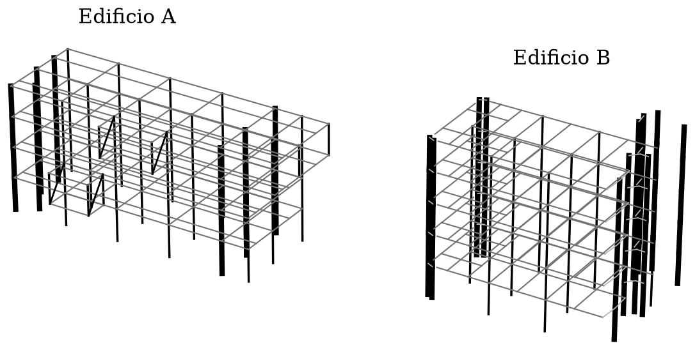
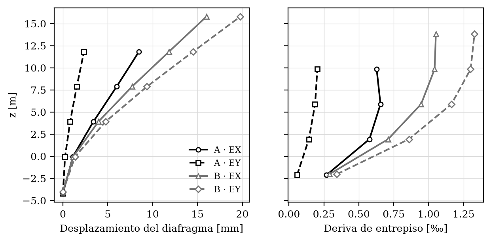
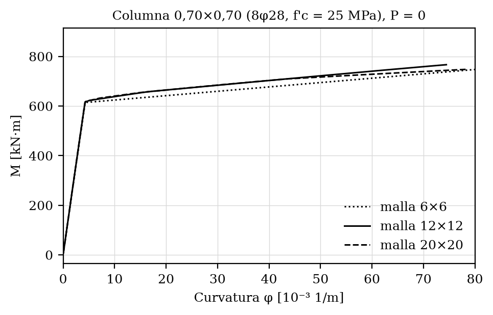
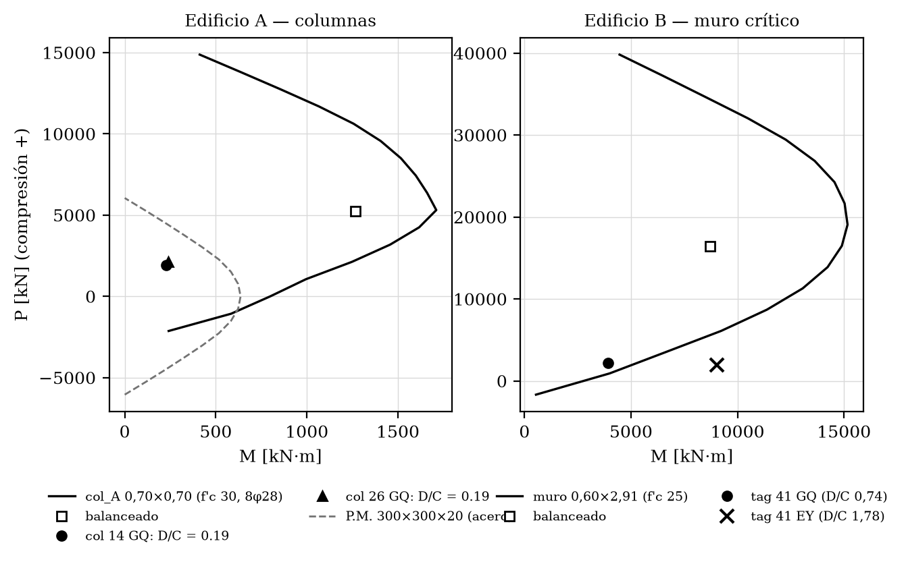
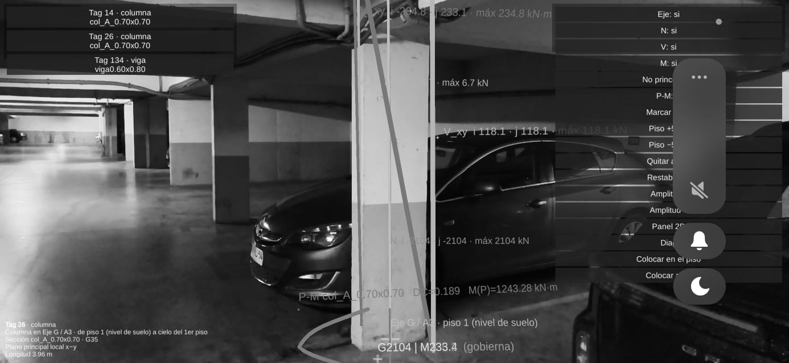
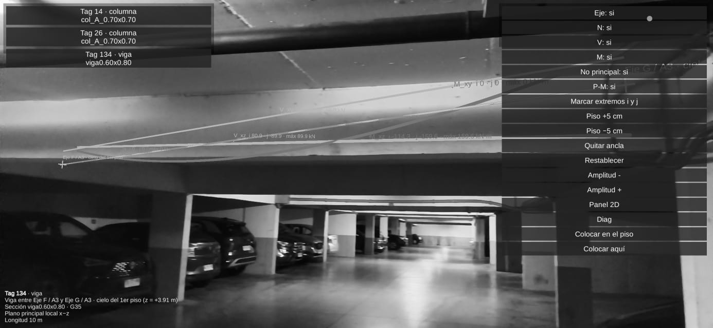
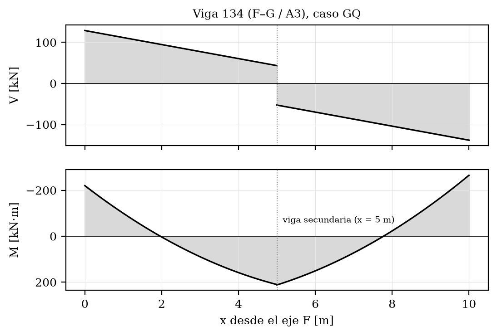

# Laboratorio estructural digital 3D — Complejo de Ingeniería (Edificios A y B)

**Informe técnico final — Proyecto 1 (Semana 7)**

| | |
|---|---|
| Universidad | Universidad de los Andes — Facultad de Ingeniería y Ciencias Aplicadas |
| Curso | Métodos Computacionales en Obras Civiles (MCOC) |
| Integrantes (Grupo 5) | Nicolás Letelier · Oscar Rodríguez · Pablo Arancibia |
| Fecha | 7 de octubre de 2026 |
| Repositorio | <https://github.com/OscarRodriguez17/Proyecto-1-MCOC-Completo> — rama `master`, tag `entrega-final` |

> Versión PDF (blanco y negro, con carátula): [`final.pdf`](final.pdf) · fuente LaTeX: [`final.tex`](final.tex).
> Este Markdown se generó desde el mismo `final.tex`, con el mismo contenido.
> Cómo reproducir el proyecto: ver [`../README.md`](../README.md).

## 1. Resumen

Se construyó un laboratorio estructural digital del Complejo de Ingeniería que une dos edificios reales de la Universidad, modelados a partir de sus planos DXF: el **Edificio A** (planos 2017_67, hormigón G35, con un anexo y voladizos metálicos) y el **Edificio B** (planos 2024_22, hormigón H30). Cada edificio es un modelo **lineal elástico 3D** en OpenSeesPy (6 grados de libertad por nodo, diafragma rígido por piso, base empotrada) que se analiza en forma independiente para cinco casos: peso propio y sobrecarga muerta (G), sobrecarga de uso (Q), su suma (GQ) y sismo pseudoestático en X e Y (EX, EY).

Sobre los resultados verificados se agregó una capa de **capacidad de hormigón armado**: un motor de secciones de fibras que entrega curvas momento–curvatura, diagramas de interacción P–M y la relación demanda–capacidad (D/C) de cada columna y muro. Todo se exporta a un **contrato JSON** único que alimenta un visor en **Unity** (pre y postprocesador) y una **app Android de realidad aumentada** que superpone los diagramas de esfuerzos de nueve elementos sobre la estructura real.

| Magnitud                                           |              Edificio A |              Edificio B |
|:---------------------------------------------------|------------------------:|------------------------:|
| Nodos / elementos                                  |               206 / 354 | 235 (+5 maestros) / 350 |
| Peso G \[kN\]                                      |                45 417,4 |                48 171,1 |
| Sobrecarga Q \[kN\]                                |                 7 671,3 |                11 029,6 |
| Corte basal $V = 0{,}10\,W$ \[kN\]                 |                 4 541,7 |                 4 817,1 |
| Desplazamiento de techo EX / EY \[mm\]             |             8,48 / 2,35 |           16,00 / 19,77 |
| Deriva máxima de entrepiso EX / EY \[‰\]           |             0,66 / 0,20 |             1,05 / 1,33 |
| Error de equilibrio (5 casos) \[kN\]               | $\le 1{,}1\cdot10^{-9}$ | $\le 3{,}5\cdot10^{-9}$ |
| Superposición, máx. $\lvert \Delta R\rvert$ \[kN\] |    $3{,}6\cdot10^{-11}$ |    $6{,}0\cdot10^{-11}$ |

Cifras principales del modelo final.

**Estado de la entrega.** La suite de Python pasa completa (**169 tests**) y la de Unity también (**153 tests** EditMode). El pipeline completo se volvió a ejecutar desde cero en un entorno limpio con las versiones fijadas en `requirements.txt` y reprodujo los archivos de resultados con el mismo contenido. Las limitaciones que siguen abiertas se declaran en la sección 19. Entre ellas está un error del motor de secciones que detectamos en la revisión final: algunos muros largos tienen puntos de la envolvente P–M con $M = 0$.

## 2. Edificio e idealización

### 2.1. Los dos edificios

**Edificio A** (planos 2017_67). Retícula de ejes E–J en $x$ (0 a 50 m) y A3–A1 en $y$ (0 a 16,15 m), con el eje intermedio A2a ($y = 2{,}31$ m). Tiene una base empotrada a $z = -4{,}21$ m y cuatro losas a $z = -0{,}05$; 3,91; 7,87 y 11,83 m. Pilares de 0,70×0,70 m, vigas V.60/80 y cinco tipos de muro (ME-32, MI-32, MI-12, M1c-E y M2a). En los dos niveles superiores hay un anexo metálico entre los ejes I’ y J, más un voladizo trasero arriostrado (ejes G y H) y un voladizo metálico de piso 1 en el eje F. Los elementos de acero son pilares P.M. 300×300×20, vigas V.M. 300×300×5 y cuatro diagonales.

**Edificio B** (planos 2024_22). Seis niveles con base empotrada a $z = -4{,}01$ m, cuatro pisos y cubierta a 15,79 m, todos con altura de piso de 3,96 m. Tiene 8 líneas de pilares de 0,70×0,70 m (40 elementos), 60 tramos de muro, vigas V.60/80, V.40/80 y V.30/80 y un bloque de escalera y ascensor.

### 2.2. Idealización común

- Elementos `elasticBeamColumn` con `geomTransf Linear` y ejes locales explícitos (`vecxz` no colineal con el eje $i\to j$).

- **Diafragma rígido** por piso (`rigidDiaphragm(3, maestro, *esclavos)` con `constraints Transformation`).

- **Base empotrada**: 23 apoyos en A y 20 en B, todos con restricción $[1,1,1,1,1,1]$.

- **Losas no modeladas como elementos**: su peso y su sobrecarga llegan a las vigas por áreas tributarias (sección 4).

- **Vigas T/L** en A: inercia fuerte con ancho efectivo de losa según ACI 318-19, Tabla 6.3.2.1. El peso propio de la viga se calcula solo con el alma.

- **Muros como columna ancha equivalente**, con su sección real ($t \times L$). En A tienen deformación por corte ($A_s = 5/6\,A$). En B se unen a las vigas con **brazos rígidos** (35 elementos).

- Materiales: G35 en A ($E = 4700\sqrt{35} = 27\,806$ MPa, $\nu = 0{,}2$, $\gamma = 25$ kN/m$^3$); H30 en B ($E = 25\,000$ MPa); acero en los elementos metálicos de A ($E = 200$ GPa, $\gamma = 78{,}5$ kN/m$^3$).

- Cada edificio se **analiza por separado**, lo que evita el doble conteo de áreas tributarias. Un módulo de fusión los reúne en un solo contrato JSON, con B desplazado 60 m en $x$ y sus tags renumerados (+100 000).

<figure>

<figcaption>Modelo OpenSeesPy de los dos edificios: pilares y muros en negro (los muros, más gruesos) y vigas en gris.</figcaption>
</figure>

## 3. Geometría y datos

### 3.1. Extracción desde los planos

La geometría sale de los DXF con `ezdxf`. El flujo siempre fue el mismo: primero se *dibuja* cada lámina para confirmar la lectura y después se recorren las capas una por una (`RLE-EJES`, `RLE-PILAR`, `RLE-MURO`, `RLE-VIGA`, `RLE-PROYECCION` y `RLE-TEXTO`). Las coordenadas y cotas verificadas quedan en `docs/ficha_geometria.md` (A), `docs/ficha_geometria_B.md` (B), `docs/info_planos_dxf.txt` y `docs/info_cortes_elevaciones.txt`. Los ejes de las vigas de B no caen exactamente sobre los ejes de la grilla, así que se consolidan con una tolerancia `GRID_TOL = 0,30 m`. Sin ese ajuste quedaban islas de vigas sueltas y la matriz de rigidez resultaba singular.

### 3.2. Del modelo base al modelo final (Edificio A)

El modelo base de A (190 nodos, 321 elementos) se fue ampliando solo con **módulos aditivos** que inyectan nodos y elementos con tags nuevos:

| Etapa (módulo)                                           |   Nodos | Elementos |     G \[kN\] |
|:---------------------------------------------------------|--------:|----------:|-------------:|
| Modelo base (`construir.py`)                             |     190 |       321 |            — |
| Voladizos, anexo y aspas (`voladizos.py`)                |     200 |       343 |     45 236,5 |
| Viga secundaria F–G, nivel 1 (`vigas_secundarias.py`)    |     203 |       348 |     45 323,5 |
| Pilar metálico de raíz, tag 349 (`pilares_metalicos.py`) |     203 |       349 |     45 330,4 |
| Viga secundaria F–G, nivel 2                             | **206** |   **354** | **45 417,4** |

Evolución del modelo del Edificio A.

La viga secundaria tiene sus extremos a mitad de las vigas F–G, que eran un solo elemento de 10 m. Para que trabajara hubo que partir esas vigas en $x = 15$ m. Es la única excepción a la regla aditiva: el tramo 10→15 *conserva su tag original* y el tramo 15→20 recibe uno nuevo. Así la viga 134 que usa la app AR sigue siendo la misma.

| Tipo de elemento                    |                   Edificio A | Edificio B |
|:------------------------------------|-----------------------------:|-----------:|
| Columnas / pilares                  |         80 (72 HA + 8 acero) |         40 |
| Muros (columna ancha)               |                           32 |         60 |
| Vigas                               | 238 (122 en $x$, 116 en $y$) |        215 |
| Diagonales (aspas) / brazos rígidos |                            4 |         35 |
| Total                               |                          354 |        350 |

Composición final de los modelos.

### 3.3. Datos y contrato

El esquema de entrada está en `data/` (`nodos.json`, `elementos.json`, `materiales.json` y `cargas.json`). Las salidas están en `results/`:

- `modelo_resultados.json` (A) y `modelo_resultados_b.json` (B): geometría, cargas, reacciones, desplazamientos y esfuerzos;

- `edificio_solido.json`: el contrato del visor Unity, con los dos edificios, catálogo P–M, demandas, esfuerzos completos y metadatos por `elementTag`;

- `ar_elementos.json`: el contrato de la app AR, con 9 elementos del Edificio A en el caso GQ.

## 4. Cargas gravitacionales y áreas tributarias

### 4.1. Cargas

Losas macizas de 15 cm: $q_G = 0{,}15\cdot25 + 2{,}55 = 6{,}30$ kN/m$^2$, donde 2,55 kN/m$^2$ es la sobrecarga muerta adicional de la lámina 700. El peso propio de vigas, columnas, muros y elementos de acero se calcula con su área y su peso unitario. En A el peso propio de cada viga se suma a la carga de la losa sobre esa viga.

### 4.2. Áreas tributarias

**A**: cada paño de losa se divide con líneas a 45° desde sus esquinas. A cada viga le corresponden triángulos o trapecios, que se transforman en una carga distribuida $w = q\cdot A_{trib}/L$. Si una viga atraviesa un paño (la viga secundaria F–G), el paño se divide en dos. Si un borde de paño no tiene una viga entera, la carga se reparte en la cadena de tramos colineales. **B**: área tributaria por viga, con un umbral interno, sobre la planta real.

|                                            |                                          Edificio A |        Edificio B |
|:-------------------------------------------|----------------------------------------------------:|------------------:|
| Área de losa cargada                       | $726{,}75\cdot4 + 80{,}75\cdot2 = 3\,068{,}5$ m$^2$ | 848,4 m$^2$/nivel |
| Carga de losa G transferida a vigas \[kN\] |                                           19 331,55 |          26 725,5 |
| Error de conservación \[kN\]               |                                $3{,}6\cdot10^{-12}$ |                 — |
| Peso propio de la estructura \[kN\]        |                                            26 085,9 |          21 445,6 |
| **G total aplicado = $\Sigma R_z$** \[kN\] |                                       **45 417,44** |     **48 171,11** |

Conservación de la carga de losa y equilibrio vertical (caso G).

**Cargas típicas en vigas.** En A, $q_G$ (losa + peso propio de 12 kN/m) llega a $\approx 45$ kN/m en las vigas interiores, con una mediana de $\approx 26$ kN/m. En B, la carga de losa $q_G$ (sin peso propio) llega a $\approx 73$ kN/m en las vigas interiores en $x$, con una mediana de $\approx 18$ kN/m. Los valores de cada viga están en `cargas.vigas[]` (`qG`, `qQ`, `G`, `Q`) del contrato. El visor los muestra con la capa *Cargas G*.

## 5. Carga viva

Sobrecargas de uso de la lámina 700: **A**: 2,5 kN/m$^2$ (salas de clase); **B**: 3,0 kN/m$^2$ en pisos y 1,0 kN/m$^2$ en la cubierta. Se reparten con las mismas áreas tributarias que la carga muerta.

| Edificio | $q_Q$ \[kN/m$^2$\] |          $\Sigma Q$ aplicada \[kN\] |                      Conservación |
|:---------|-------------------:|------------------------------------:|----------------------------------:|
| A        |                2,5 | 7 671,25 ($= 2{,}5\cdot3\,068{,}5$) |            exacta (triangulación) |
| B        |          3,0 / 1,0 |      11 029,56 ($= 13\cdot848{,}4$) | 99,6 % (*bbox* vs. polígono real) |

Carga viva Q.

En B, la carga aplicada usa el rectángulo de planta (848,4 m$^2$), mientras que el polígono real de losa mide $\approx 844{,}6$ m$^2$. La diferencia es de 0,4–0,5 %. En el caso GQ las reacciones verticales son 53 088,69 kN (A) y 59 200,68 kN (B), iguales a la carga aplicada.

## 6. Sismo pseudoestático

**Método.** Corte basal $V = \alpha W$ con $\alpha = 0{,}10$ y $W = G$. La fuerza en cada nivel se reparte en altura con

$$
F_i = V\,\frac{W_i\,z_i}{\sum_j W_j\,z_j},
$$

donde $z$ es la cota *absoluta*, medida desde la base. Así A y B se comparan con el mismo criterio. Por eso $F_1$ resulta pequeña y negativa: el nivel 1 está a $z = -0{,}05$ m. Las fuerzas se aplican en el nodo maestro de cada diafragma, en X (EX) y en Y (EY) por separado.

| Nivel A  | $W_i$ \[kN\] | $F_i$ \[kN\] | Nivel B  | $W_i$ \[kN\] | $F_i$ \[kN\] |
|:--------:|-------------:|-------------:|:--------:|-------------:|-------------:|
|    1     |     11 098,2 |     $-9{,}3$ |    1     |      9 634,2 |     $-6{,}1$ |
|    2     |     11 007,2 |        718,1 |    2     |      9 634,2 |        478,7 |
|    3     |     11 635,9 |      1 528,0 |    3     |      9 634,2 |        963,4 |
|    4     |     11 676,2 |      2 304,8 |    4     |      9 634,2 |      1 448,2 |
|          |              |              |    5     |      9 634,2 |      1 933,0 |
| $\Sigma$ |     45 417,4 |  **4 541,7** | $\Sigma$ |     48 171,1 |  **4 817,1** |

Pesos y fuerzas sísmicas por nivel.

**Resultados.** El corte basal se recupera en las reacciones ($\Sigma R_x = -4\,541{,}74$ kN en A y $-4\,817{,}11$ kN en B). Los momentos volcantes son 61 221 kN·m (A) y 76 424 kN·m (B).

<figure>

<figcaption>Desplazamiento del diafragma y deriva de entrepiso bajo EX y EY.</figcaption>
</figure>

- En A, la deriva máxima es 0,66 ‰ (EX, piso 3) y 0,20 ‰ (EY). En Y el edificio es mucho más rígido gracias a los muros largos de los ejes E e I.

- En B, la deriva máxima es 1,05 ‰ (EX) y 1,33 ‰ (EY), en los dos pisos superiores.

- **Torsión**: la rotación del techo de B es $r_z = 6{,}94\cdot10^{-4}$ rad bajo EX, unas **69 veces** la de A ($1{,}01\cdot10^{-5}$), y unas 14 veces bajo EY. La causa es la distribución excéntrica de muros y masa en B: núcleo al sur y un bloque superior sin núcleo.

- Todas las derivas están muy por debajo de los límites usuales (2 ‰ en la NCh433), pero hay que recordar que $\alpha = 0{,}10$ es un valor fijo del enunciado, no un espectro de diseño.

## 7. Superposición

En un análisis **lineal elástico** la matriz de rigidez $K$ no depende de la carga. Por eso la respuesta a una combinación es la suma ponderada de las respuestas a cada caso:

$$
R\Big(\sum_i \lambda_i F_i\Big) = \sum_i \lambda_i R(F_i),
$$

donde $\lambda_i$ es el factor de cada caso. Por ejemplo, $\lambda_G = \lambda_Q = 1$ en GQ, y 1,2 y 1,6 en una combinación mayorada. La igualdad deja de valer si hay no linealidad del material o geométrica (P–$\Delta$), porque entonces $K$ cambia con la carga. Se verificó numéricamente comparando una **corrida directa** del caso combinado con la **suma** de los casos simples.

| Edificio | Combinación     | máx. $\lvert \Delta R\rvert$ \[kN\] | máx. $\lvert \Delta u\rvert$ \[m\] |
|:---------|:----------------|------------------------------------:|-----------------------------------:|
| A        | G+Q $\equiv$ GQ |                $7{,}3\cdot10^{-12}$ |               $7{,}6\cdot10^{-19}$ |
| A        | G+EX            |                $6{,}2\cdot10^{-12}$ |               $1{,}6\cdot10^{-17}$ |
| A        | G+Q+EX          |                $3{,}6\cdot10^{-11}$ |               $6{,}5\cdot10^{-18}$ |
| B        | G+Q $\equiv$ GQ |                $2{,}9\cdot10^{-11}$ |               $8{,}7\cdot10^{-18}$ |
| B        | G+EX            |                $5{,}6\cdot10^{-11}$ |               $1{,}8\cdot10^{-16}$ |
| B        | G+Q+EX          |                $6{,}0\cdot10^{-11}$ |               $1{,}7\cdot10^{-16}$ |

Verificación de la superposición: corrida directa contra suma de casos.

A nivel de elemento también se comparó, componente por componente, la suma G+Q con GQ. En A (112 elementos) la máxima diferencia es $\Delta P = 3{,}9\cdot10^{-11}$ kN y $\Delta M = 1{,}9\cdot10^{-11}$ kN·m. En B (100 elementos) es $\Delta P = 4{,}7\cdot10^{-11}$ kN y $\Delta M = 7{,}8\cdot10^{-10}$ kN·m. El módulo $M = \sqrt{M_y^2 + M_z^2}$ *no* se superpone, porque no es lineal; por eso la comparación se hace por componente. Las diferencias son del orden del error de redondeo de un número de doble precisión.

**En el visor.** La verificación llega a Unity como dato: el contrato trae el bloque `secciones.superposicion` con las tres combinaciones, y la ventana P–M muestra el indicador $\lvert \Delta P\rvert$. El *toggle* interactivo para superponer casos con factores $\lambda$ **no se implementó** (sección 19).

## 8. Análisis global y verificaciones

| Verificación               | Resultado                                                                                                                                                                                                                 |
|:---------------------------|:--------------------------------------------------------------------------------------------------------------------------------------------------------------------------------------------------------------------------|
| Equilibrio global, 5 casos | $\lvert \Sigma F + \Sigma R\rvert  \le 1{,}1\cdot10^{-9}$ kN en A y $\le 3{,}5\cdot10^{-9}$ kN en B, en las tres componentes.                                                                                             |
| Conservación tributaria    | Carga de losa transferida $=$ $q\cdot A$ (error $3{,}6\cdot10^{-12}$ kN en A).                                                                                                                                            |
| Corte basal                | $\Sigma R_x = -V$ y $\Sigma R_y = -V$ en EX y EY (A: 4 541,74; B: 4 817,11 kN).                                                                                                                                           |
| Cierre de diagramas        | En las 238 vigas de A y las 215 de B, y en los 5 casos, los diagramas evaluados en $x = L$ reproducen los esfuerzos del extremo $j$ (`localForce`).                                                                       |
| Test analítico             | Viga biapoyada con carga central: la flecha de OpenSees coincide con $PL^3/48EI$ (Euler–Bernoulli) a $< 10^{-10}$.                                                                                                        |
| Contrato JSON              | Los tags apuntan a nodos existentes, la conectividad, los apoyos y la cobertura de esfuerzos por caso están verificados (`test_json_contrato.py`, `test_complejo.py`).                                                    |
| Reproducibilidad           | `python src/complejo.py –sin-visualizar` con openseespy 3.8.0.0, en un entorno nuevo, seguido de `exportar_ar.py –tags`, regeneró los archivos de resultados con el mismo contenido (solo puede cambiar el fin de línea). |

Verificaciones del análisis global (todas automáticas en la suite de tests).

**Corrección del signo de $M_z(x)$ (semana 6).** El visor evaluaba $M_z(x) = M_z + V_y x + W_y x^2/2$. Lo correcto es $M_z(x) = M_z - V_y x - W_y x^2/2$, porque en los ejes locales de OpenSees $dM_z/dx = -V_y$. La evidencia fue la cabeza de la columna 14 en GQ: el visor mostraba $-672{,}3$ kN·m y OpenSees daba $+219$. Se corrigió en las tres fórmulas del visor y en `src/secciones/diagramas.py`, y se agregó un test que exige el cierre $M_z(L) = -M_{z,j}$.

## 9. Fiber Sections

El motor (`src/secciones/`) representa cada sección como un conjunto de fibras:

- **Hormigón**: `Concrete01` (Hognestad, sin tracción) con $\varepsilon_{c0} = -0{,}002$ y $\varepsilon_{cu} = -0{,}004$.

- **Acero de refuerzo**: `Steel01` con $f_y = 420$ MPa, $E_s = 200$ GPa y endurecimiento $b = 0{,}01$.

- **Discretización**: una grilla de $6\times6$, $12\times12$ o $20\times20$ fibras de hormigón, con la fibra al centro de cada celda, y *una fibra por barra* con el área de esa barra.

**Por qué fibras explícitas.** En openseespy 3.8.0 el comando `patch(’rect’)` dio un $EA$ un 93 % mayor que el teórico en una celda de $1\times1$. Con fibras explícitas, $EA$ y $EI$ coinciden con los valores analíticos a $< 10^{-4}$. Un integrador 100 % Python (`analitica.py`) sirve de contraste independiente.

| Sección                                               | Armado y material                                                                                                                                                                                                                                               |
|:------------------------------------------------------|:----------------------------------------------------------------------------------------------------------------------------------------------------------------------------------------------------------------------------------------------------------------|
| Columna 0,70×0,70                      | 8$\phi$28, 4 por cara, recubrimiento al eje de 5 cm (plano 101, capa RLE-PILAR). $\rho = 1{,}0$ %.                                                                                                                                                      |
| Muros de A (5 secciones)                              | **Supuesto**: los planos de A no traen la armadura de los muros (lo confirmamos con otros grupos). Se usó doble malla $\phi$10@0,20 ($\rho_v \approx 0{,}003$) y 6$\phi$16 por extremo en $L_b = \max(2t; 0{,}15L)$, con recubrimiento de 3 cm. |
| Muros de B (11 secciones)                             | Bordes de 0,40 m con 4$\phi$16 y alma $\phi$12@0,20 por cara, con recubrimiento de 5 cm (receta uniforme `muro_b1`).                                                                                                                            |
| P.M. 300×300×20 (acero) | Plastificación total del cajón. Acero A270ES, $f_y = 270$ MPa (**supuesto**: los planos no indican la calidad).                                                                                                                                                 |
| $f'_c$ de sección                                     | A: 30 MPa (G35); B: 25 MPa (valor representativo del enunciado). Los modelos elásticos usan el $E$ de la sección 2.                                                                                                                                             |

Secciones del catálogo y supuestos de armado.

## 10. M–φ

**Procedimiento** (`curva.py`). Sección en un elemento `zeroLengthSection`. Primero se aplica la carga axial con `LoadControl`; si no converge, se refina el paso en 1/2/4/8. Después, con la carga axial fija, se aplica un momento unitario con `DisplacementControl` sobre el giro. Se lee $M$ = `getTime()` y $\varphi$ = `nodeDisp(2,3)`. La curva termina por aplastamiento ($\varepsilon_c \le \varepsilon_{cu}$), por rotura del acero ($\varepsilon_{su} = 0{,}09$), por ablandamiento ($M < 0{,}85\,M_{max}$) o por falta de convergencia.

<figure>

<figcaption>Momento–curvatura de la columna 0,70×0,70 con tres mallas.</figcaption>
</figure>

| Malla                | $EI_0$ \[kN·m$^2$\] | $M_{max}$ \[kN·m\] | Fin de curva    |
|:---------------------|--------------------------:|-------------------------:|:----------------|
| $6\times6$           |                   144 124 |                      870 | tope de pasos   |
| $12\times12$         |                   145 879 |                      766 | no convergencia |
| $20\times20$         |                   146 399 |                      748 | aplastamiento   |
| Integrador analítico |                   146 991 |                        — | —               |

Resultados M–φ de la columna ($P = 0$) y sensibilidad a la malla.

- La rigidez inicial agrietada con malla $12\times12$ difiere del valor analítico en $-0{,}8$ %. Las tres mallas quedan dentro del 2 % en $EI_0$.

- $EI_0 \approx 0{,}29\,E I_g$ (con $E = 2f'_c/\varepsilon_{c0} = 25$ GPa e $I_g = 0{,}020$ m$^4$). Este número justifica, por ejemplo, usar una inercia reducida en un análisis con secciones agrietadas.

- La fluencia aparece cerca de $M_y \approx 615$ kN·m. $M_{max}$ depende de dónde termina la curva, por eso cambia más con la malla que $EI_0$.

- Con $P = 3\,000$ kN: $EI_0 = 4{,}55\cdot10^5$ kN·m$^2$ y $M_{max} = 1\,376$ kN·m. La compresión retrasa el agrietamiento.

## 11. P–M columna y muro

**Barrido** (`pm.py`). Se calculan 17 niveles de carga axial, desde la tracción pura ($-1{,}03\,f_y A_s$) hasta la compresión ($\approx 1{,}03\,P_0$). Para cada nivel se obtiene la curva M–φ y se toma su momento máximo. El punto balanceado corresponde a $\varepsilon_c = \varepsilon_{cu}$ en la fibra extrema y $\varepsilon_s = \varepsilon_y$ en el acero opuesto. Convención: $P>0$ es compresión.

**Verificación con cálculo a mano** (columna, $f'_c = 25$ MPa):

- $P_{0,ACI} = 0{,}85 f'_c (A_g - A_s) + f_y A_s
          = 0{,}85\cdot25\,000\cdot0{,}48507 + 420\,000\cdot0{,}004926 = 12\,376{,}7$ kN, igual al motor.

- $P_{0,fibra} = f'_c(A_g-A_s) + E_s\lvert \varepsilon_{c0}\rvert A_s = 14\,097{,}3$ kN, también igual. La razón $P_{0,fibra}/P_{0,ACI} \approx 1{,}15$ se repite en las 12 secciones y viene de usar $f'_c$ en vez del bloque $0{,}85f'_c$. Es una diferencia de convención, no un error.

- El pico de la envolvente (4 379 kN; 1 530 kN·m) se compara con el valor de aceptación del enunciado (4 500; 1 395): $-2{,}7$ % en $P$ y $+9{,}7$ % en $M$, dentro de la tolerancia del 10 %.

- Pilar de acero: $P_0 = f_y A = 6\,048$ kN y $M_p = f_y Z = 636{,}1$ kN·m. Se verificó un punto con el eje neutro en las almas: $P = 756$ kN da $M = 622{,}9$ kN·m, igual al cálculo analítico.

<figure>

<figcaption>Diagramas de interacción con puntos de demanda. Izquierda: columna de A con las columnas 14 y 26 de la app AR, y el pilar de acero. Derecha: muro crítico de B (tag 41) en GQ y en EY.</figcaption>
</figure>

| Sección                                       | $A_s$ \[cm$^2$\] | $P_{0,ACI}$ \[kN\] | Balanceado $(P; M)$ |    Pico $(P; M)$ |
|:----------------------------------------------|-----------------:|-------------------:|--------------------:|-----------------:|
| col_A 0,70×0,70 ($f'_c$ 30)    |             49,3 |             14 438 |      (5 242; 1 265) |   (5 308; 1 711) |
| col 0,70×0,70 ($f'_c$ 25)      |             49,3 |             12 377 |      (4 370; 1 158) |   (4 379; 1 530) |
| muro 0,60×2,91 (B)             |             38,7 |             38 646 |     (16 407; 8 705) | (19 065; 15 167) |
| muro_A 0,20×6,60               |             60,3 |             36 037 |    (15 498; 19 322) | (17 256; 32 551) |
| muro_A 0,20×7,25               |             63,4 |             39 476 |    (17 066; 22 942) | (18 959; 39 149) |
| P.M. 300×300×20 |      224 (acero) |              6 048 |                   — |         (0; 636) |

Puntos característicos de las envolventes principales.

**Error detectado en la revisión final.** Cinco envolventes de muros largos tienen puntos con $M = 0$:

- de A: muro_A 0,30×7,25 y 0,30×8,90;

- de B: 0,20×9,44, 0,20×11,59 y 0,25×7,95.

En esos niveles de $P$ la curva M–φ no converge y el barrido devuelve 0 en lugar de descartar el punto. Las columnas y el muro 0,60×2,91 no tienen este problema. Las consecuencias están en la sección 12.

## 12. Demanda–capacidad

Para cada columna y muro, y para cada caso:

$$
\text{D/C} = \frac{M_d}{M_{cap}(P_d)}, \qquad M_d = \sqrt{M_y^2 + M_z^2},
$$

donde $M_{cap}(P_d)$ se interpola linealmente en la envolvente P–M de la sección de ese `elementTag`, al mismo nivel de carga axial. La demanda se evalúa en los dos extremos del elemento y gobierna el de mayor momento. En una columna sin carga transversal $N$ es constante y $M$ varía linealmente, así que el máximo siempre está en un extremo. Son demandas **de servicio**: no tienen factores de mayoración y la capacidad no tiene factores $\phi$.

| Elemento                             | Caso | $P_d$ \[kN\] | $M_d$ \[kN·m\] | $M_{cap}$ \[kN·m\] |      D/C |
|:-------------------------------------|:-----|-------------:|---------------------:|-------------------------:|---------:|
| A col 14 (app AR)                    | GQ   |      1 899,9 |                229,5 |                  1 195,0 |     0,19 |
| A col 26 (app AR)                    | GQ   |      2 130,6 |                239,5 |                  1 249,2 |     0,19 |
| A pilar P.M. 73                      | GQ   |          3,8 |                215,0 |                    636,1 |     0,34 |
| B col 2                              | GQ   |      8 145,9 |              1 278,4 |                  1 223,5 | **1,04** |
| B col 5                              | GQ   |      1 773,4 |              1 291,9 |                  1 143,1 | **1,13** |
| B muro 41 (0,60×2,91) | GQ   |      2 175,2 |              3 912,3 |                  5 270,9 |     0,74 |
| B muro 41 (0,60×2,91) | EY   |      1 973,5 |              9 022,8 |                  5 066,6 | **1,78** |

Demanda–capacidad de los elementos de referencia.

- **Edificio A, columnas** (80, incluidos los 8 pilares de acero): el D/C máximo es 0,45 en GQ y 0,43 en EX. Ninguna supera 1.

- **Edificio B, columnas** (40): dos superan 1 en GQ (tags 5 y 2).

- **Muros con envolvente válida**: en B superan 1 dos en GQ (tag 77, a tracción, 1,21; tag 46, 1,04) y seis en EX y en EY (máx. 4,7–4,8, muros 42 y 46, que trabajan a tracción). En A supera 1 un muro en EX (tag 100, 2,15).

- **Fuera de la envolvente**: algunos muros de B tienen una tracción mayor que la de tracción pura de su sección, y ahí no hay capacidad que interpolar ni D/C. Son el muro 76 en GQ, los muros 41, 51 y 52 en EX y los muros 76 y 77 en EY. Hay que leerlos como muros que exceden su capacidad a tracción. No están en los conteos de arriba.

- Los casos EX y EY se evalúan *solos*, sin la gravedad que los acompaña. Por eso varios muros quedan a tracción y fuera de la zona útil de la envolvente. Para un diseño habría que evaluar las combinaciones reglamentarias mayoradas, que no forman parte del alcance.

- **No confiables**: los 16 muros de A (tags 84–99) y los 15 de B cuyas secciones tienen puntos con $M = 0$. Por ejemplo, el muro 95 de A aparece con D/C = 3,05 en GQ porque su capacidad interpolada cae en uno de esos puntos. Esos valores no deben leerse como una falla.

## 13. Unity como pre/postprocesador

**Arquitectura.** Python → contrato JSON → Unity. El visor (`unity/EdificioSolidoUnity`, Unity 2022.3.62f3) **no calcula nada**: reconstruye la escena completa desde `StreamingAssets/edificio_completo.json` (`UnityStickModel.cs`, `ModeloComplejo.cs` y `OrbitCamera.cs`). La escena `Main.unity` pesa unos 10 KB, porque no tiene geometría guardada. Al principio había una escena de 64 MB con la geometría guardada en ella, que quedaba desactualizada respecto del JSON y era la causa del “modelo deforme” que veíamos. Eso se corrigió.

**Preprocesador.** El botón *Recargar JSON* vuelve a leer el contrato sin cerrar el editor y reconstruye todas las capas. En Android, la carga busca primero `Application.persistentDataPath`. Así, **los datos se actualizan en el teléfono sin recompilar el APK** (`scripts/subir_json_telefono.ps1` hace el `adb push` y lo verifica). El panel muestra la fuente y la fecha del JSON cargado.

**Postprocesador.** Al hacer clic en una columna, viga o muro se abre un panel con:

- tag, tipo, sección, material (hormigón o acero), nodos, restricciones y ejes locales;

- los esfuerzos $N, V_y, V_z, T, M_y, M_z$ del caso activo, evaluados en la posición $x$ del deslizador;

- una ventana de diagramas 2D y una ventana P–M con la envolvente, el punto balanceado, la demanda, $M_{cap}(P_d)$ y el D/C.

**Trazabilidad** (ejemplo: muro B tag 41):

1.  `elementTag` 41 en OpenSees (nodos 49→50);

2.  `esfuerzos_completos.GQ."41"` y `metadatos."41"` en el JSON;

3.  el `BoxCollider` del panel del muro en Unity;

4.  el panel de consulta: $N = 2\,175{,}2$ kN y $M_z = 3\,909{,}2$ kN·m en $x = 0$;

5.  la sección `muro0.60x2.91` del catálogo;

6.  $M_{cap} = 5\,270{,}9$ kN·m, D/C = 0,74.

**Vista combinada.** Desde la sesión 28, los dos edificios se dibujan lado a lado. La cámara inicial queda de frente al eje J de A, con B a la izquierda, y la sensibilidad de rotación subió de 0,25 a 3 (la ajustamos tras la revisión del profesor). Solo cambian la cámara y el desplazamiento con que se dibujan los edificios: las coordenadas de los datos no se tocan.

## 14. Visualización de apoyos, cargas, ejes y diagramas

| Capa           | Estado   | Qué muestra y de dónde sale                                                                                                              |
|:---------------|:---------|:-----------------------------------------------------------------------------------------------------------------------------------------|
| Apoyos         | completa | Zapatas o conos en los 23 + 20 apoyos empotrados (`apoyos`).                                                                             |
| Cargas G / Q   | completa | Cargas distribuidas por viga (`cargas.vigas[]`: $q_G$, $q_Q$).                                                                           |
| Cargas sismo   | completa | Flechas $F_i$ por nivel para EX/EY (`cargas.sismo`).                                                                                     |
| Tributaria 45° | parcial  | Mosaico de reparto por viga; dibuja solo $q_G$.                                                                                          |
| Ejes locales   | parcial  | Están en `metadatos.ejes_locales` y orientan los diagramas, pero no se dibujan como triadas.                                             |
| Deformada      | completa | Casos Base/G/GQ/EX/EY con amplificación 0–2000 (desplazamientos de los nodos maestros).                                                  |
| Diagramas 3D   | completa | $N$, $M_y$ y $M_z$ sobre cada elemento, con escala automática.                                                                           |
| Ventana 2D     | completa | Axial, corte ($V_z$, $V_y$) y momento ($M_y$, $M_z$) con los extremos, el máximo y su posición. $T$ solo se muestra como valor numérico. |
| Material       | completa | Los elementos de acero se dibujan con el lado de su perfil (0,30 m) y un material metálico gris.                                         |

Capas del visor y su estado.

Los diagramas 3D se escalan para que su amplitud mida $\approx 15$ % de la luz. Por eso sirven para ver la forma; los valores exactos se leen en el panel y en la ventana 2D.

## 15. Modificación del modelo

**Flujo**: editar un dato → volver a analizar → refrescar las cachés de secciones → exportar el contrato → *Recargar JSON*. Los cuatro primeros pasos son comandos documentados en el README; el último es un botón. No hace falta editar ninguna escena a mano.

| Modificación                                                              | Antes                              | Después                            |
|:--------------------------------------------------------------------------|:-----------------------------------|:-----------------------------------|
| **MOD1** B: sobrecarga `SC_PISO` 3,0 → 4,0 kN/m$^2$                   | Q = 11 029,6 kN                    | Q = 14 423,3 kN                    |
| muro 41, GQ                                                               | D/C = 0,74                         | D/C = 0,79                         |
| **MOD2** B: espesor del muro `MUROS_V[0]` 0,60 → 0,70 m               | $P_{0,ACI}$ = 38 646 kN            | 44 830 kN                          |
| techo EX / EY                                                             | 16,00 / 19,77 mm                   | 15,74 / 19,28 mm                   |
| **MOD3** A: viga secundaria F–G (niveles 1 y 2) y pilar metálico 349      | 343 elementos, G = 45 236,5        | 354, G = 45 417,4                  |
| viga 134 (GQ): $M_i$ / $M_j$                                              | $-114{,}3$ / $-159{,}6$ kN·m | $-220{,}0$ / $-265{,}3$ kN·m |
| **MOD4** A: pilares y diagonales de acero (material, perfil y P–M propia) | curva de hormigón                  | curva P.M. de acero                |

Modificaciones ejecutadas de punta a punta, con el antes y el después.

- MOD1 y MOD2 se ejecutaron y después se volvió al estado canónico.

- MOD3 y MOD4 son cambios permanentes, hechos al revisar los planos.

- Al cambiar la sección, la envolvente creció más que la demanda. Con más carga de uso, la demanda crece y la capacidad casi no cambia.

- Cambiar la inercia ($EI$) modifica la *demanda*: desplazamientos, derivas y reparto de momentos en una estructura hiperestática. Cambiar la cuantía modifica la *capacidad*, es decir la curva P–M, pero no los esfuerzos del análisis elástico.

## 16. AR

### 16.1. Objetivo y flujo

La app Android (`Assets/Scenes/AR_Inspeccion.unity`, AR Foundation 4.2.0 con ARCore) es una herramienta de inspección en obra. El usuario elige un elemento de una lista de **nueve** (caso GQ, Edificio A), marca su posición real con el teléfono y ve encima sus diagramas $N$, $V$ y $M$; en columnas y muros también ve el panel P–M. Los elementos son:

- columnas **14** y **26** (ejes F y G, A3);

- vigas **134** y **350** (F–G, A3) y **354** (la viga secundaria F–G);

- los elementos de acero del voladizo del eje F: la viga **337**, el pilar **340** y la diagonal **342**;

- el muro **105**.

**No se usa marcador impreso**: la referencia es el propio elemento.

elemento real → pose ARCore → `ARAnchor` → transformación → geometría del elemento → resultado

Los valores no se calculan en el teléfono. Son los muestreos de `ar_elementos.json`, que `src/ar/exportar_ar.py` exporta desde los mismos resultados verificados. Hay 17 tests que comparan esos diagramas con `localForce` de OpenSees en los dos extremos.

### 16.2. Transformación

$$
\mathbf{p}_{mundo} = \mathbf{t}_A + \Delta h\,\hat{\mathbf{y}} +
R_y(\theta)\,\big(C\,\mathbf{p} - \mathbf{a}\big), \qquad
C = \begin{bmatrix}1&0&0\\0&0&1\\0&1&0\end{bmatrix}
$$

- $C$ pasa de OpenSees $(x,y,z)$ a Unity $(x,z,y)$, con $\det C = -1$: cambia de un sistema de mano derecha a uno de mano izquierda, así que la geometría no sale espejada.

- $\mathbf{a}$ es el punto de anclaje del elemento: su base, a nivel del piso.

- $R_y(\theta)$ es solo un giro en planta. La vertical la fija la gravedad que mide ARCore.

- $\Delta h$ es el ajuste de piso, en pasos de $\pm5$ cm.

- $\mathbf{t}_A$ es la posición del ancla. La escala es 1:1.

- En una viga, $\theta$ sale de la dirección entre los dos apoyos marcados y el ancla queda en el punto medio. La app avisa si la distancia medida difiere de $L$ en más de un 10 %.

### 16.3. Modos de colocación (versión final: corrección 10 + cambio_01)

- **Encuadrar: 4 esquinas.** Se tocan las cuatro esquinas de la cara del elemento, en cualquier orden. La primera esquina fija la distancia y las otras tres se proyectan sobre un plano de frente a la cámara, así que el diagrama queda como una figura 2D, igual que una imagen impresa. Se dibuja dentro de ese recuadro, en 3 bandas ($N$, $V$ y $M$), sin anillo y sin profundidad. Los rótulos quedan impresos en ese plano y con el tamaño justo para caber.

- **Marcar base (anillo).** Se toca el pie de la columna. El punto se lleva media sección hacia adentro, hasta el eje.

- **Marcar viga: apuntar a ella.** Se apunta a la cara inferior de la viga cerca de cada columna, usando la profundidad de ARCore. El eje de la viga queda sobre los ejes de las columnas.

- **Marcar viga: pie de columnas**, la alternativa al modo anterior.

- Además: *Panel 2D* con los mismos valores en un recuadro fijo, siempre legible; *Piso ±5 cm*; *Quitar ancla*; *Diag*, con un diagnóstico de tracking y profundidad; y un menú plegable.

- Desde cambio_01, todos los rótulos (también los del dibujo 1:1) **quedan fijos al colocarse**: ya no giran ni cambian de tamaño cuando la cámara se mueve.

Cada elemento tiene su propia ancla. Si ARCore pierde el seguimiento, los diagramas se ocultan en vez de quedar flotando en un lugar equivocado.

### 16.4. Precisión y resultados

<figure>

 

<figcaption>Prueba de terreno de la semana 6: columna 26 (izquierda) y viga 134 (derecha). Los rótulos de las fotos son anteriores a las sesiones 26–29; los valores vigentes están en la tabla siguiente.</figcaption>
</figure>

- **Alineamiento medido** sobre la foto de la columna 26, con escala de 6 mm/px: el error lateral es de **1–2 cm** en el pie y en la cabeza, sin inclinación apreciable.

- **Presupuesto de error esperado**: 2–5 cm. Contribuyen el toque (±2–5 cm), el piso (±5 cm, corregible), la verticalidad (0,2–0,5°) y la deriva de ARCore (1–2 % de lo caminado).

- Esa precisión alcanza para identificar el elemento, la cara y el extremo $i/j$, pero no para medir deformaciones, que son milimétricas.

| Tag | Elemento (sección)                                                             |    $N$ \[kN\] | $M_i$ \[kN·m\] | $M_j$ \[kN·m\] |  D/C |
|:----|:-------------------------------------------------------------------------------|--------------:|---------------------:|---------------------:|-----:|
| 14  | Columna F/A3 (0,70×0,70)                                        | $-1\,899{,}9$ |           $-223{,}1$ |                217,0 | 0,19 |
| 26  | Columna G/A3 (0,70×0,70)                                        | $-2\,130{,}6$ |           $-231{,}4$ |                230,9 | 0,19 |
| 134 | Viga F–G/A3, $L = 10$ m (V.60/80)                                              |   $\approx 0$ |           $-220{,}0$ |           $-265{,}3$ |    — |
| 350 | Segundo tramo de la 134 (misma viga física)                                    |   $\approx 0$ |           $-220{,}0$ |           $-265{,}3$ |    — |
| 354 | Viga secundaria F–G, $L = 7{,}25$ m ($M^+ = 139{,}2$)                          |   $\approx 0$ |            $-42{,}0$ |            $-66{,}4$ |    — |
| 337 | Viga de acero V.M. 300×300×5, $L = 7{,}5$ m      |           0,1 |            $-18{,}4$ |                 14,3 |    — |
| 340 | Pilar de acero P.M. 300×300×20                   |     $-12{,}1$ |            $-10{,}5$ |                 14,3 | 0,02 |
| 342 | Diagonal de acero V.M. 300×300×5, $L = 5{,}85$ m |          23,9 |             $-6{,}4$ |             $-1{,}3$ |    — |
| 105 | Muro M2a (0,20×3,70)                                            |    $-219{,}8$ |                125,2 |                140,4 | 0,04 |

Valores vigentes de los elementos AR (caso GQ, `ar_elementos.json`).

<figure>

<figcaption>Viga 134 en GQ. La viga secundaria apoyada en <em>x</em> = 5 m introduce un salto de corte de  ≈ 96 kN.</figcaption>
</figure>

La viga 134 quedó partida en $x = 5$ m por la viga secundaria. La app la sigue mostrando como *una* viga física de columna a columna, porque encadena los tramos 134 y 350. El momento al centro es $+211{,}9$ kN·m. El equilibrio se cumple: $(\lvert M_i\rvert  + \lvert M_j\rvert )/2 + M_c \approx 454{,}6$ kN·m, contra $wL^2/8 + PL/4 = 453{,}8$ kN·m. La diferencia, de 0,2 %, es el salto de $\approx 1{,}7$ kN·m que produce en $x = 5$ m la torsión de la viga secundaria.

La lista de la app se arma sola a partir del JSON, así que pasar de 3 a 9 elementos no requirió tocar la interfaz: bastó con regenerar el contrato (`exportar_ar.py –tags ...`). Hay dos detalles a tener en cuenta:

- El tag 350 es el segundo tramo de la viga 134. Como el exportador encadena los tramos, se ve como la misma viga física.

- La diagonal 342 aparece con tipo “viga”, porque en el modelo es `vigas_y` y el exportador no tiene un tipo “diagonal”.

**Build**: Android, minSdk 24, IL2CPP ARM64, OpenGLES3, ARCore requerido, paquete `com.mcoc.edificiocomplejo.ar`. Se genera desde el menú *Tools/MCOC/Build Android AR*. El APK final (`MCOC_AR_EdificioComplejo.apk`, 24,6 MB, con los 9 elementos) se compiló en Windows con 153/153 tests de EditMode y 0 errores de compilación. Va adjunto al Release `entrega-final`.

## 17. Sidequests implementados

- **Sidequest “carga móvil”: no implementada.** Quedó documentada, con el diseño para una versión 2 (línea de influencia, deslizador de posición y conservación $\Sigma P_i = W$), en el informe de la semana 5. El modelo es lineal y estático, y el edificio no tiene cargas vehiculares reglamentarias.

Extensiones que sí implementamos, fuera del núcleo pedido:

1.  **Datos actualizables en el teléfono sin recompilar**: precedencia `persistentDataPath` → `StreamingAssets`, script `adb` con verificación y botón *Usar JSON del APK*.

2.  **Diagrama de interacción de pilares metálicos**: un perfil cajón con plastificación total, verificado analíticamente (`src/secciones/acero.py`).

3.  **App AR con nueve elementos** (hormigón y acero; columna, viga, diagonal y muro), sin cambiar la interfaz, porque la lista sale del contrato.

4.  **Cuatro modos de colocación AR y Panel 2D**, con la vertical corregida, el ajuste de piso y la ocultación al perder el tracking.

5.  **Complejo A+B en un solo visor**, con la fusión de contratos y la vista lado a lado.

6.  **Viga física encadenada** en la app AR: los tramos colineales unidos en nudos sin columna se muestran como una sola viga.

## 18. QA y tests

| Archivo                         | Tests | Qué protege                                                                                                                     |
|:--------------------------------|------:|:--------------------------------------------------------------------------------------------------------------------------------|
| `test_benchmark.py`             |    38 | Geometría de A, secciones, conservación tributaria, equilibrio, superposición, Euler–Bernoulli y modelo base intacto (190/321). |
| `test_secciones.py`             |    40 | Motor de fibras, P–M, catálogos A y B, demandas, superposición y overlay del visor.                                             |
| `test_json_contrato.py`         |    22 | Contrato del visor: tags, nodos, conectividad y apoyos.                                                                         |
| `test_ar_elementos.py`          |    17 | Contrato AR, diagramas contra `localForce`, D/C y viga encadenada.                                                              |
| `test_viga_secundaria_fg.py`    |     9 | Viga secundaria: conteos, tags, diafragma, áreas tributarias y +87 kN por nivel.                                                |
| `test_esfuerzos_a.py`           |     8 | Diagramas de las 238 vigas de A: equilibrio y cierre.                                                                           |
| `test_complejo.py`              |     8 | Fusión A+B y contrato unificado.                                                                                                |
| `test_acero_elementos.py`       |     5 | Elementos de acero: material, perfil y P–M propia.                                                                              |
| `test_edificio_b/` (5 archivos) |    22 | Geometría, análisis, sismo, tributario y esfuerzos de B.                                                                        |

Suite de Python: `python -m pytest tests -q` da 169 tests aprobados.

- **Unity**: Test Runner EditMode, **153/153**. Cubren la colocación, el encuadre, el piso, los rótulos, el panel 2D, la interfaz (que no haya botones tapados) y la configuración XR de Android.

- Para iterar sin abrir Unity, 150 de esos tests (todos menos los 3 de XR) se compilan con Mono contra *stubs* de UnityEngine. El resultado se confirmó después en Unity.

- **Entornos probados**: Windows (equipo del grupo) y Linux. Python 3.11 y 3.12, con openseespy 3.7.1.2 y 3.8.0.0: los 169 tests pasan en todas esas combinaciones.

- **Pruebas de terreno**: las pruebas con el teléfono, con fotos y videos, guiaron las correcciones 3 a 10 de la app. El cambio_01 (encuadre plano y rótulos fijos) y la lista de 9 elementos se verificaron con los tests (153/153) y con el APK compilado.

- **Regla de trabajo**: ningún cambio se aceptó con tests en rojo, y cada número de este informe sale de un archivo de `results/` regenerable.

## 19. Limitaciones

1.  **Modelo lineal elástico de primer orden**: no considera P–$\Delta$, agrietamiento ni plasticidad en el análisis global. Las inercias son brutas, aunque el M–φ indica $EI_{cr} \approx 0{,}3\,EI_g$.

2.  **Sismo**: método pseudoestático con $\alpha = 0{,}10$ fijo, sin análisis modal ni espectral, sin torsión accidental y sin combinaciones reglamentarias mayoradas.

3.  **Capacidad**: el D/C es de servicio. La flexión biaxial se combina como $\sqrt{M_y^2+M_z^2}$ contra una curva uniaxial. Las vigas no tienen armadura modelada (solo demanda) y no hay verificación de corte ni de pandeo.

4.  **Envolventes con $M = 0$** en cinco secciones de muros largos, por falta de convergencia (sección 12). Los D/C de esos 31 muros no son confiables. *Corrección pendiente*: descartar o refinar los puntos que no convergen en `pm.py`.

5.  **Supuestos de armado y materiales**: la armadura de los muros de A no está en los planos; para el acero de los pilares se supuso A270ES; en las secciones de B se usó $f'_c = 25$ MPa.

6.  **Visor**: no tiene *toggle* de superposición interactiva; los ejes locales no se dibujan; la capa tributaria muestra solo $q_G$; $T$ no tiene gráfico; el visor clásico no tiene gestos táctiles.

7.  **AR**: nueve elementos del Edificio A y un solo caso (GQ); colocación manual. `src/complejo.py` exporta por defecto solo 3 elementos: para regenerar el contrato de 9 hay que correr `exportar_ar.py –tags` (README, paso 3). La precisión es de centímetros. La viga 134 coincide con la realidad solo en el Edificio A. Las versiones intermedias (correcciones 8–9) empeoraron en terreno y hubo que volver atrás en parte.

8.  **Bug conocido**: `scripts/semana03_run.py –recalcular` parte con la caché vacía y borra las curvas genéricas de B. Para refrescar solo las combinaciones hay que usar `superposicion.verificar` sobre la caché cargada.

## 20. Uso de IA

### 20.1. Herramientas

- **Claude** (Anthropic): en un proyecto de claude.ai con los planos y la bitácora como contexto, y en sesiones de agente con acceso a una copia del repositorio.

- **opencode**: un agente de código con acceso directo al repositorio en Windows, usado para integrar cambios en varios archivos, actualizar tests y compilar.

### 20.2. Tareas delegadas

- Scripts de extracción DXF y fichas de geometría (que nosotros revisamos contra los planos dibujados).

- Módulos del modelo (`voladizos.py`, `vigas_secundarias.py`, `pilares_metalicos.py`) y el modelo de B.

- El motor de secciones completo (`src/secciones/`, 13 módulos).

- El visor Unity y la app AR: unas 9 200 líneas de C# y 153 tests.

- Los tests de Python, la redacción inicial de los informes semanales y este informe, que nosotros revisamos.

### 20.3. Errores detectados

| Error del agente o de la herramienta                                                                                                                                                                                                 | Cómo se detectó y qué se hizo                                                                                                                                                                                   |
|:-------------------------------------------------------------------------------------------------------------------------------------------------------------------------------------------------------------------------------------|:----------------------------------------------------------------------------------------------------------------------------------------------------------------------------------------------------------------|
| Signo de $M_z(x)$ en el visor ($-672{,}3$ en lugar de $+219$ kN·m).                                                                                                                                                            | Comparando con `localForce` de OpenSees. Se corrigió la fórmula y se agregó un test de cierre.                                                                                                                  |
| Los 20 muros de 0,20 m del bloque superior de B tomaban la sección de la columna.                                                                                                                                                    | Revisión del catálogo; ahora hay un test que exige 60 muros con sección propia.                                                                                                                                 |
| Las columnas no mostraban su P–M en el visor (clave de catálogo).                                                                                                                                                                    | Prueba en Play; se agregó un alias y una búsqueda en tres niveles.                                                                                                                                              |
| Un verificador entregó $M(0) \approx 220$ kN·m (no había llegado al pico).                                                                                                                                                     | Contraste con el integrador analítico; el valor real es 750–870.                                                                                                                                                |
| Los elementos de acero aparecían como hormigón y con la P–M de una columna de HA.                                                                                                                                                    | Lo notamos en el visor; ahora tienen material, perfil y P–M de acero propios.                                                                                                                                   |
| El agente cambió los finales de línea de un archivo completo al editar una línea.                                                                                                                                                    | Lo vimos en el diff; se revirtió y se hizo una edición que conserva los bytes.                                                                                                                                  |
| Las correcciones 8 y 9 de la app AR empeoraron la colocación en terreno (esquinas en el piso detrás del elemento, textos enormes).                                                                                                   | Con fotos y videos de las pruebas. En la corrección 10 se volvió en parte a la versión anterior y se fijó el tamaño de los textos.                                                                              |
| Al consolidar la entrega en un segundo equipo, la sincronización automática reemplazó la bitácora principal por la del equipo de compilación, y se perdió el registro de las sesiones 22–29.                                         | Se detectó al comparar los dos paquetes de entrega. Se restauró `docs/bitacora.md` y la otra quedó como `docs/bitacora_apk_pablo.md`.                                                                           |
| En el repo consolidado, un helper de `LlenarElementosTests.cs` recorría el diccionario de elementos como si fuera una lista y no compilaba. Eso habría dejado sin compilar el ensamblado Editor, con los tests y los menús de build. | Se detectó compilando los tests fuera de Unity. Se corrigió usando `Raiz().EnOrden()`; ahora pasan 150 de 150 sin Unity (153 con XR). El APK no se vio afectado: se compiló desde una copia que sí estaba bien. |
| Un test de interfaz de Unity comparaba un botón consigo mismo.                                                                                                                                                                       | Falló en el Test Runner de Windows; se excluyó la comparación consigo mismo.                                                                                                                                    |
| Envolventes P–M con puntos $M = 0$ (sin convergencia).                                                                                                                                                                               | Se detectó en la revisión de este informe; queda documentado como pendiente.                                                                                                                                    |

### 20.4. Verificaciones

No aceptamos un número solo porque el agente lo afirmara. Cada resultado se contrastó de al menos una de estas formas:

- cálculo a mano: $P_0$, $M_n$ por par de fuerzas, $M_p$ del acero y $wL^2/8$;

- comparación con OpenSees: `localForce` y reacciones;

- equilibrio y conservación de carga;

- la suite de 169 + 153 tests;

- pruebas de terreno con el teléfono;

- la reproducción completa del pipeline en un entorno limpio.

El propio verificador también falló una vez ($M(0) \approx 220$). Por eso exigimos una referencia independiente tanto para el agente como para el verificador.

### 20.5. Contribución real del agente

Siendo honestos: **la mayor parte de las líneas de código las escribieron los agentes**, tanto en Python como en C#. Lo que aportamos nosotros fue:

- las decisiones de alcance (qué elementos, qué niveles, qué supuestos);

- la lectura y validación de los planos;

- la definición de qué había que verificar y con qué referencia;

- las pruebas en el teléfono y en terreno;

- el criterio para rechazar versiones que empeoraban;

- la defensa técnica de los resultados.

Sin esa supervisión, varios errores de la tabla anterior habrían llegado a la entrega.

## 21. Contribución individual

| Integrante       | Contribuciones                                                                                                                                                                            | Módulo revisado                                                 | Error detectado                                                                                                    | Concepto aprendido                                                                                                            |
|:-----------------|:------------------------------------------------------------------------------------------------------------------------------------------------------------------------------------------|:----------------------------------------------------------------|:-------------------------------------------------------------------------------------------------------------------|:------------------------------------------------------------------------------------------------------------------------------|
| Nicolás Letelier | Coordinación del trabajo con los agentes de IA; cargas, sismo y verificaciones; motor de secciones; edición de los informes.                                                              | `src/secciones/` (fibras, P–M, D/C) y `benchmark_3d/cargas.py`. | El signo de $M_z(x)$ en el visor: en la cabeza de la columna 14 mostraba $-672$ y OpenSees daba $+219$ kN·m. | La superposición solo vale con $K$ constante (análisis lineal). La inercia cambia la demanda; la cuantía cambia la capacidad. |
| Pablo Arancibia  | Implementación del modelo base del Edificio A en OpenSeesPy; compilación de los APK en Windows (correcciones, cambio_01 y versión final de 9 elementos); pruebas de terreno de la app AR. | `benchmark_3d/construir.py` y la app AR en el teléfono.         | En terreno: las esquinas del encuadre caían en el piso detrás del elemento (corrección 8).                         | Cómo el diafragma rígido reparte la carga sísmica, y el cambio de ejes OpenSees → Unity → ARCore.                     |
| Oscar Rodríguez  | **Arquitectura**: trabajo con los planos DXF y diseño de los dos edificios para el modelo; repositorio y entregas en GitHub; visor Unity y presentación de la parte de AR.                | Visor Unity: `UnityStickModel.cs` y `OrbitCamera.cs`.           | La escena de 64 MB con la geometría guardada en ella, que mostraba un modelo deforme distinto del JSON.            | Separar datos y diseño en el APK: el JSON se actualiza sin recompilar.                                                        |

Contribución de cada integrante.

## 22. Honors Track

El grupo declara dos de los cinco ítems Honors (H1–H5) y explica por qué no aplican los demás:

| Ítem                                 | ¿Aplica? | Justificación                                                                                                                                                                                                                                                                                                    |
|:-------------------------------------|:--------:|:-----------------------------------------------------------------------------------------------------------------------------------------------------------------------------------------------------------------------------------------------------------------------------------------------------------------|
| H3 — AR estructural avanzada         |    Sí    | La app coloca elementos reales a escala 1:1 marcando el propio elemento, sin marcador impreso. Dibuja $N$, $V$ y $M$ y muestra el panel P–M con el D/C junto al elemento. Tiene nueve elementos, un ancla de ARCore por elemento, encuadre plano y una precisión medida de 1–2 cm (sección 16).                  |
| H5 — Capacidad / análisis avanzado   |    Sí    | Análisis no lineal de sección por fibras: M–φ, envolventes P–M y D/C por elemento contra la envolvente de su sección. Incluye la P–M de los pilares de acero, la superposición verificada y las capacidades regeneradas al modificar el modelo (secciones 9 a 12 y 15). No incluye P–M biaxial ni segundo orden. |
| H1 — VR (Cardboard)                  |    No    | No se desarrolló.                                                                                                                                                                                                                                                                                                |
| H2 — AR multimarcador / persistencia |    No    | Marcado a toque, con un ancla por elemento y sin imágenes aumentadas.                                                                                                                                                                                                                                            |
| H4 — Reanálisis en vivo              |    No    | El análisis corre en el PC; el teléfono recibe datos (*Recargar JSON* o `adb push`).                                                                                                                                                                                                                             |

Declaración Honors Track.

## Anexo A. Reproducibilidad (resumen)

El detalle completo está en `README.md`. En resumen:

    python -m venv .venv
    .venv\Scripts\Activate.ps1          # Windows (Linux/Mac: source .venv/bin/activate)
    pip install -r requirements.txt     # Python 3.12, openseespy 3.8.0.0
    python src\complejo.py --sin-visualizar   # analisis A+B, fusion, contratos Unity/AR
    python src\ar\exportar_ar.py --tags 134 14 26 354 350 337 340 342 105   # contrato AR de 9
    python scripts\final_figuras.py           # figuras del informe
    python -m pytest tests -q                 # 169 passed

Unity 2022.3.62f3: abrir `unity/EdificioSolidoUnity`, escena `Main.unity` (visor) o `AR_Inspeccion.unity` (AR); correr *Test Runner → EditMode → Run All* (153), y generar el APK con *Tools/MCOC/Build Android AR*.
