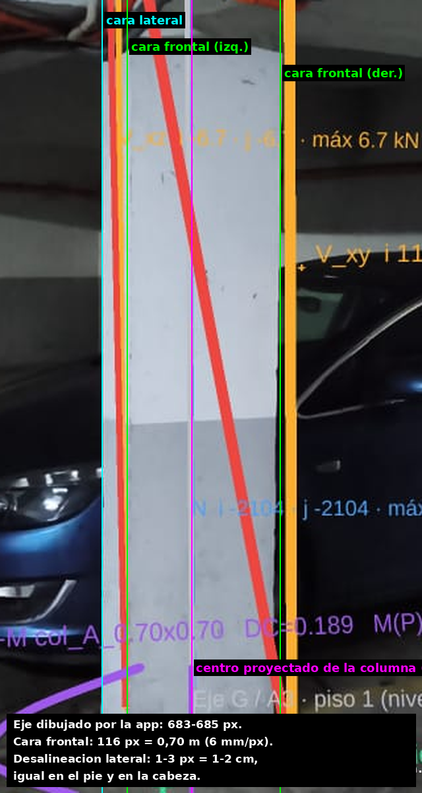
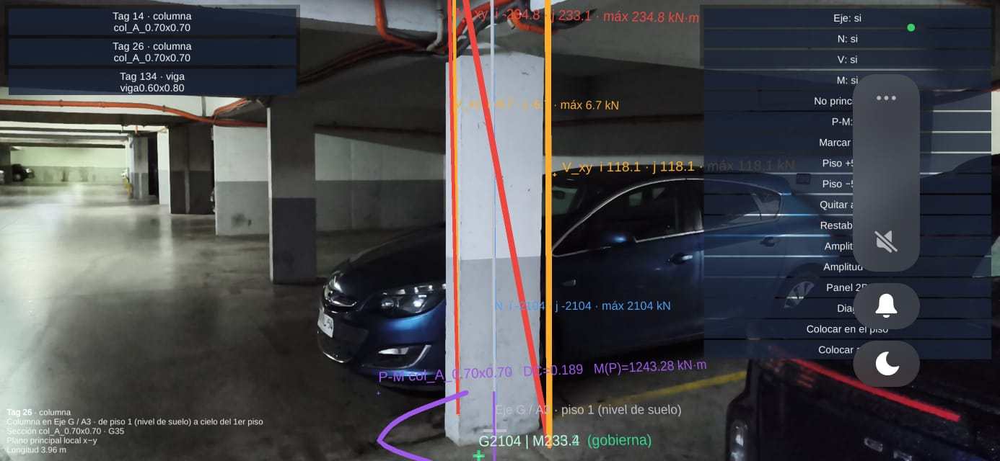
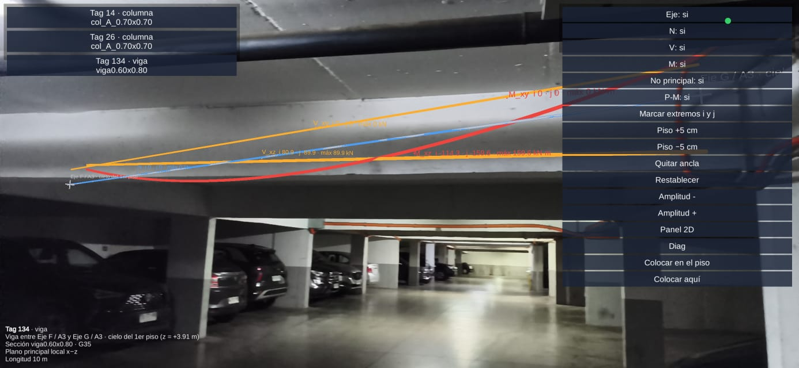

# Reporte — Semana 06: Validación AR y cierre técnico

**Proyecto:** Laboratorio estructural digital 3D — Complejo de Ingeniería (Edificios A y B).
**Grupo:** Nicolás Letelier · Oscar Rodríguez · Pablo Arancibia.
**Rama:** `semana06-ar` — https://github.com/OscarRodriguez17/Proyecto-1-MCOC-Completo/tree/semana06-ar
**Elementos AR:** Edificio A, caso **GQ** (servicio, sin mayorar) — columna **14** (Eje F/A3),
columna **26** (Eje G/A3) y viga **134** (F–G/A3, cielo del 1er piso).
**Unidades:** m, kN, kN·m.

> El registro técnico de las sesiones 19–20 (corrección del signo de `Mz(x)`,
> diseño inicial de la app, build Android y versiones de paquetes) está en
> [`semana06_anexo_sesiones19_20.md`](semana06_anexo_sesiones19_20.md).

---

## 1. Flujo AR

```
marker ──► pose ──► anchor ──► transform ──► elemento ──► resultado
```

La app **no usa marcador impreso**. El «marker» es el **propio elemento real**:
el usuario toca en la pantalla el pie de la columna (o el pie de las dos
columnas que sostienen la viga). Así el registro no depende de dónde esté
parado el usuario ni de imprimir y pegar nada en obra.

| Paso | Qué ocurre | Dónde está en el código |
|---|---|---|
| **1. Marker** | El usuario elige el tag y pulsa **«Marcar base»** (columna) o **«Marcar extremos i y j»** (viga). Toca el **pie de la cara visible** de cada columna. La mira fija del centro y el anillo (amarillo = piso detectado, naranja = piso estimado) muestran dónde caerá el punto. | `ARInspeccionApp.IniciarMarcadoBase / IniciarMarcadoViga / MarcarPunto` |
| **2. Pose** | ARCore entrega la pose 6-DOF de la cámara en cada cuadro (`TrackedPoseDriver`). El toque se convierte en un rayo de cámara y se intersecta con el piso: plano detectado → piso ya conocido → *feature point* cercano al piso → piso estimado 1,40 m bajo la cámara. | `ARPiso`, `ResolverPuntoPiso`, `PuntoPisoDesdeRayo` |
| **3. Anchor** | Se crea un `ARAnchor` **sólo con posición** (sin rotación) en el punto de base. Columna: el punto tocado se lleva media sección (0,35 m) hacia adentro, al eje. Viga: cada toque se lleva al eje de su columna de apoyo y el ancla queda en el punto medio. ARCore mantiene el ancla pegada al mundo real mientras el usuario camina. | `ARColocacion.BaseDesdeCara`, `ARApoyos.ColumnaBajoExtremo`, `ARColocacion.PorDosPuntos` |
| **4. Transform** | Cadena de transforms ancla → raíz visual (ajuste de piso ±5 cm) → contenedor (giro en planta) → geometría del elemento en coordenadas Unity, ya restado su punto de anclaje. Escala 1:1. Detalle en §2. | `ColocarEnAncla`, `AplicarOffsetPiso` |
| **5. Elemento** | Se dibujan el eje, N, V y M del **plano principal**, los rótulos de los extremos i/j y, en columnas, el panel P–M al pie. Los textos giran siempre hacia la cámara (`ARBillboard`). | `ARGeometriaBuilder`, `ARBillboard` |
| **6. Resultado** | Los valores **no se calculan en el teléfono**: son los valores muestreados que exporta `src/ar/exportar_ar.py` desde OpenSees a `StreamingAssets/ar_elementos.json`. El botón **«Panel 2D»** muestra los mismos N/V/M en un recuadro fijo, legible aunque el AR no calce perfecto. | `ARCargador`, `ARGrafico` |

---

## 2. Transformación

### 2.1 Sistemas involucrados

| Sistema | Ejes | Origen |
|---|---|---|
| **OpenSees (SI)** | x, y en planta; **z vertical** | origen del modelo del Edificio A |
| **Unity** | X, Z en planta; **Y vertical** | mismo origen, ejes permutados |
| **Local del elemento** | igual que Unity | **punto de anclaje** del elemento (su base a nivel de piso) |
| **Mundo AR** | Y vertical alineado con la **gravedad** (ARCore); X, Z arbitrarios | definido por la sesión ARCore al arrancar |

### 2.2 Composición

Para un punto `p` del modelo en coordenadas OpenSees:

```
p_mundo = t_A + Δh·ŷ + R_y(θ) · ( C·p − a )
```

| Símbolo | Significado | Valor |
|---|---|---|
| `C` | permutación OpenSees → Unity: `(x, y, z) ↦ (x, z, y)` | matriz `[[1,0,0],[0,0,1],[0,1,0]]` |
| `a` | `anclaje.punto_unity` del elemento (base del elemento a nivel de piso) | col 26: `(20, −0,05, 0)`; viga 134: `(15, −0,05, 0)` |
| `R_y(θ)` | giro **sólo en planta** (yaw) del contenedor | ver §2.3 |
| `Δh` | ajuste de piso acumulado con «Piso ±5 cm», aplicado a la raíz visual (nunca al ancla, porque ARCore reescribe la pose del `ARAnchor`) | múltiplos de 0,05 m |
| `t_A` | posición del `ARAnchor` en el mundo AR | punto marcado en terreno |
| escala | **1:1** en toda la cadena: 1 m del modelo = 1 m real | `localScale = (1,1,1)` |

Como jerarquía de Unity:
`ARSessionOrigin ▸ ARAnchor (t_A, sin giro) ▸ raizVisual (Δh) ▸ contenedor (R_y(θ)) ▸ geometría (C·p − a)`.

`C` cambia la mano del sistema (`det C = −1`). Es justo lo que hace falta,
porque OpenSees usa ejes derechos y Unity izquierdos. Por eso la geometría sale
sin espejo y los rótulos i/j quedan en su lugar.

### 2.3 Cómo se obtiene θ

- **Viga (dos puntos):** con los ejes de las columnas de apoyo `P_i`, `P_j`
  proyectados a la horizontal,
  `θ = atan2( (ê_x × d̂)·ŷ , ê_x·d̂ )`, con `ê_x` el eje local x de la viga en
  Unity y `d̂ = (P_j − P_i)/|P_j − P_i|`. El ancla queda en el punto medio:
  `t_A = (P_i + P_j)/2`, a la cota del punto más bajo. La app compara
  `|P_j − P_i|` con `L` y avisa si la diferencia supera el 10 %.
- **Columna (un punto):** la columna es vertical por construcción, porque el
  eje Y del mundo AR es la gravedad. θ sólo decide hacia dónde se abre el
  diagrama, y se elige para que su plano quede de frente a la cámara.

### 2.4 Comprobación numérica (viga 134)

Marcando el pie de las columnas 14 y 26 en `(10, 0, −0,35)` y `(20, 0, −0,35)`
(caras visibles), los apoyos se corrigen a `(10, 0, 0)` y `(20, 0, 0)`, de
donde salen `t_A = (15, 0, 0)` y `θ = 0`. Para el extremo i:

```
C·(10, 0, 3,91) − a = (10, 3,91, 0) − (15, −0,05, 0) = (−5, 3,96, 0)
p_mundo = (15, 0, 0) + (−5, 3,96, 0) = (10, 3,96, 0)
```

El extremo i queda sobre el eje de la columna 14, a 3,96 m sobre el piso marcado.
El test `ARApoyosTests.Viga134_MarcadaPorElPieDeSusColumnas_QuedaSobreSusEjes`
comprueba exactamente esto.

---

## 3. Precisión

### 3.1 Medición sobre la foto de terreno (columna 26)



Método: se toma como escala el ancho de la cara frontal de la columna en la foto
(116 px ≙ 0,70 m, es decir 6 mm/px). Se compara el eje que dibuja la app con el
centro proyectado de la columna real, que es el centro de la cara frontal
corrido medio ancho de la cara lateral visible.

| Altura | Centro real [px] | Eje dibujado [px] | Error |
|---|---|---|---|
| pie | ≈ 685 | 684 | ≈ 1 px ≈ **1 cm** |
| cabeza | ≈ 686 | 683 | ≈ 3 px ≈ **2 cm** |

**Error lateral ≈ 1–2 cm**, el mismo en el pie y en la cabeza, así que no se ve
inclinación. Es menos de 1/30 de la sección (0,70 m). La escala supone una cara
de 0,70 m; si la columna real tuviera otra sección, el error cambia en la misma
proporción.

### 3.2 Presupuesto de error (estimación simple)

| Fuente | Magnitud | Efecto |
|---|---|---|
| Toque sobre el pie (`e_t`) | ±2–5 cm | traslada el ancla `e_t` |
| Piso estimado / plano | ±5 cm (se corrige con «Piso ±5 cm») | sube o baja todo el elemento |
| Giro de la viga | `δθ ≈ √2·e_t / d` → 0,4° para `e_t = 5 cm`, `d = 10 m` | el error en los extremos sigue siendo `e_t`, porque ahí se marcó |
| Verticalidad (gravedad ARCore) | ≈ 0,2–0,5° | 1–3 cm en la cabeza de una columna de 3,96 m |
| Deriva de ARCore al caminar | ≈ 1–2 % de lo caminado | se corrige volviendo a marcar |

**Error esperado de alineamiento: 2–5 cm.** Basta para identificar el
elemento, la cara y el extremo i/j, que es lo que exige la inspección. No sirve
para medir deformaciones, que son de orden milimétrico (la deriva del techo en EX
es 9 mm).

---

## 4. Resultados

### 4.1 Elemento real: columna 26 (Eje G / A3)



| Campo | En pantalla | En el contrato (`ar_elementos.json`, GQ) |
|---|---|---|
| **ID** | `Tag 26 · columna`, `col_A_0.70x0.70` | `elementTag 26`, nodos 47 → 83 |
| **N** | `N i −2104 · j −2104 · máx 2104 kN` | `−2103,96 kN` |
| **M plano principal** | `M_xy i −234.8 · j 233.1 · máx 234.8 kN·m` | `−234,77 / +233,10` |
| **V plano principal** | `V_xy i 118.1 · j 118.1` | `118,15 kN` |
| **P–M** | `DC = 0.189`, `M(P) = 1243.28 kN·m`, demandas `2104 \| M235.2` (i, gobierna) y `M233.4` (j) | `DC 0,189`, `M_cap(P) 1243,28`, demanda i `(2103,96; 235,23)` |

**Evidencia de correspondencia:**

1. **Geometría:** el eje dibujado cae sobre el eje de la columna real, con error
   de 1–2 cm (§3.1), y el P–M aparece al pie, en el extremo i.
2. **Números:** los rótulos son los del contrato. El momento del P–M es la
   resultante de los dos planos:
   `√(234,77² + 14,66²) = 235,23 kN·m`. Por eso el P–M muestra 235,2 y el
   diagrama M_xy muestra 234,8, y ambos son correctos.
3. **Cadena hasta OpenSees:** `test_diagramas_reproducen_localforce_en_ambos_extremos`
   compara los diagramas con `localForce` en los dos extremos, y
   `test_columnas_demanda_coincide_con_motor_de_secciones` compara el D/C con el
   motor P–M.

### 4.2 Viga 134 (F–G / A3, cielo del 1er piso)



`M_xz i −114,3 · j −159,6 kN·m`, máximo positivo `+77,2 kN·m` en `x = 4,74 m`,
donde `V = 0`. Además `V_xz i 80,9 · j −89,9 kN` y `N ≈ 0`. El cierre de la
viga continua da `(|M_i| + |M_j|)/2 + M⁺ = 137,0 + 77,2 = 214,1 kN·m = w·L²/8`
(test `test_viga_134_valores_de_referencia`). En pantalla los valores coinciden
con el contrato. La geometría **no** coincide con el lugar de la prueba
(errores conocidos, §6).

### 4.3 Columna 14 (Eje F / A3)

`N −1870,9 kN`, `M_xy i −226,5 · j +219,4 kN·m` y `D/C 0,191`. El valor
`+219,4` en la cabeza es el que dejó la corrección del signo de `Mz(x)`
(anexo, §1).

---

## 5. QA final estructural

| Prueba | Estado | Evidencia |
|---|---|---|
| **Equilibrio G** | ✅ | A: ΣF_z aplicada 45 236,479 kN = ΣR_z 45 236,479 kN. B: 48 171,114 = 48 171,115 |
| **Equilibrio Q** | ✅ | A: 7 671,25 = 7 671,25 kN. B: 11 029,564 = 11 029,564 kN |
| **Corte basal EX** | ✅ | A: V = 4 523,648 kN = ΣR_x (0,10·G). B: 4 817,111 kN. Momento volcante A 61 009 kN·m |
| **Corte basal EY** | ✅ | A: 4 523,648 kN = ΣR_y. B: 4 817,111 kN |
| **Superposición** | ✅ | G+Q ≡ GQ, G+EX, G+Q+EX: max ΔR ≤ 6,0e-11 kN, max ΔP = 2,0e-11 kN (A, 111 elementos), max ΔD ≤ 1,8e-16 m |
| **M–φ** | ✅ (*) | col 0,70×0,70, P = 0: EI₀ = 1,458e5 kN·m² frente al analítico agrietado 1,470e5 (−0,8 %). M_max 766 kN·m. Malla 6/12/20 dentro del 10 % |
| **P–M columna** | ✅ | A col 0,70×0,70: balanceado (4 370 kN; 1 158 kN·m). Col 14 D/C 0,191, col 26 D/C 0,189 (GQ) |
| **P–M muro** | ✅ | B tag 41 `muro0.60x2.91`: GQ D/C 0,74 (M_cap 5 270,9). EY D/C **1,78: excede**, se marca en rojo y se informa (§6) |
| **IDs Unity** | ✅ | El `elementTag` de OpenSees es el mismo en el JSON, el visor y la app AR (14, 26, 134). `test_json_contrato.py`: tags → nodos existentes, conectividad, apoyos |
| **AR** | ✅ con observaciones | 110/110 tests EditMode. APK probado en Android. Alineamiento 1–2 cm en la columna 26 (§3). Pendientes visuales en §6 |

**Suites:** `python -m pytest tests -q` → **155 tests** (154 + 1 dependiente de la
versión de OpenSees, ver (*)). Unity Test Runner (EditMode) → **110/110**.

(*) `test_mfi_p0_elastico_agrietado` pasa con openseespy 3.7.1.2 y falla con
3.8.0.0 (la versión fijada en `requirements.txt`). El cambio de versión mueve
el resultado de la curva, no el modelo. Ver §6.

---

## 6. Errores conocidos

Sin ocultar:

1. **La prueba AR no se hizo en el Edificio A.** Se probó en un
   estacionamiento. La columna calza (§3), pero la viga 134 mide 10 m entre los
   ejes F y G, y allí la luz y la altura libre son otras. Por eso el diagrama de
   la viga no coincide con una viga real y las columnas dibujadas (3,96 m)
   atraviesan un cielo más bajo. **Falta la prueba en el Edificio A real.**
2. **El menú derecho tapa ~30 % de la pantalla.** El extremo j de la viga y sus
   rótulos quedan debajo de los botones.
3. **Diagramas en cero.** Con «No principal: sí» se dibujan `M_xy` y `V_xy`
   de la viga, que valen 0. Son líneas sin información. Por defecto el toggle
   parte en «no», pero conviene no dibujar nunca un diagrama nulo.
4. **Rótulos chicos o encimados.** A 3–4 m casi no se leen en el teléfono, y
   las demandas i/j del P–M quedan una sobre otra al pie de la columna. El
   Panel 2D es el respaldo legible.
5. **La viga se coloca bien sólo si sus columnas están a la vista.** Si un pie
   está tapado (por ejemplo, un auto), el punto cae en el piso estimado
   (anillo naranja) y el error crece a ±5–10 cm.
6. **`test_mfi_p0_elastico_agrietado` depende de la versión de openseespy**
   (§5).
7. **Muro B tag 41 en EY: D/C = 1,78.** Es un resultado, no un error de
   software: con el armado del catálogo de muros del Edificio B la demanda sísmica de servicio excede la envolvente.
8. **La superposición interactiva (toggle) del visor no está implementada.** Se
   verifica numéricamente y con un indicador (semana 05, §3).
9. **El commit `1c6e43d`** quedó en otra copia local y falta recuperarlo en
   la rama.

---

## 7. Plan final

### Núcleo (lo mínimo para cerrar el proyecto)

- [ ] Prueba AR en el **Edificio A**, sobre las columnas 14/26 y la viga 134.
      Fotos con medición de alineamiento como en §3.1.
- [ ] Merge de `semana06-ar` a `master` (*fast-forward*, sin conflictos).
- [ ] Recuperar el commit `1c6e43d`.
- [ ] Informe final y guion de defensa: flujo §1, transform §2, precisión §3,
      QA §5.

### Polish

- [ ] Menú plegable (botón «Menú»), que se pliega solo al terminar de colocar.
- [ ] No dibujar diagramas nulos y quitar el toggle «No principal» de la vista
      normal.
- [ ] Rótulos más grandes, con tamaño según la distancia a la cámara.
- [ ] Fijar openseespy en una sola versión y ajustar el rango del test M–φ.

### Honors

- [ ] Más elementos en el contrato AR (un muro del Edificio B con su P–M y su
      D/C en EY).
- [ ] Selector de caso (G/Q/GQ/EX/EY) dentro de la app AR.
- [ ] Superposición interactiva G+Q / G+EX en el visor.
- [ ] Registro automático con un marcador de imagen (ARCore Augmented Images)
      como alternativa al marcado manual.
